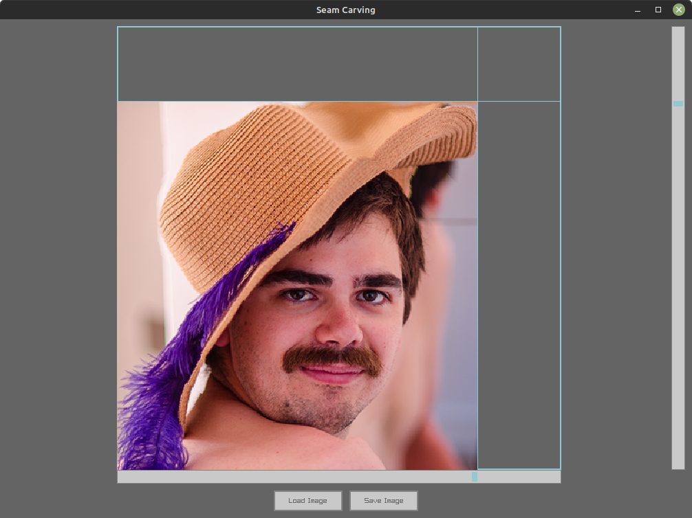
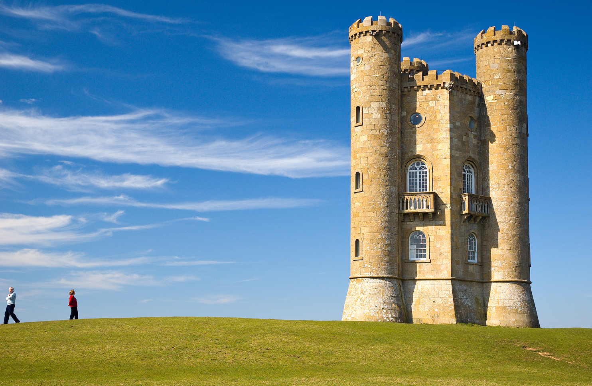
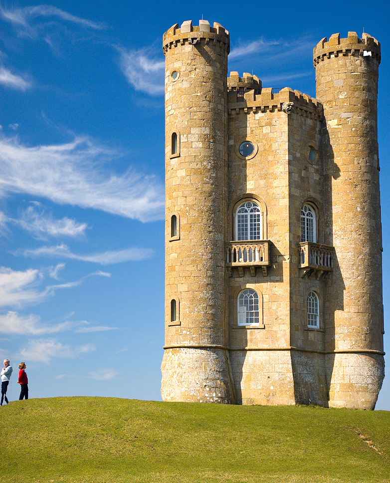
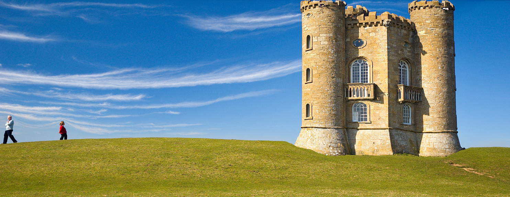

# Seam Carving

Resize images without distorting important details.

### Build

    $ ./build.sh seam.cpp seam [run]

### Requirements

[raylib](https://github.com/raysan5/raylib)

[raygui](https://github.com/raysan5/raygui)

### Notes

- Currently only supports .png images.
- The energy function used is $` e(I) = |\frac{\partial}{\partial x}I| + |\frac{\partial}{\partial y}I| `$

### Credits

- 'Seam carving for content-aware image resizing' by Avidan and Shamir [https://dl.acm.org/doi/10.1145/1275808.1276390](https://dl.acm.org/doi/10.1145/1275808.1276390)
- Broadway Tower image from [https://en.wikipedia.org/wiki/Seam_carving](https://en.wikipedia.org/wiki/Seam_carving)
- Ethically sourced Lena picture by Morten Rieger Hannemose [https://mortenhannemose.github.io/lena/](https://mortenhannemose.github.io/lena/)
